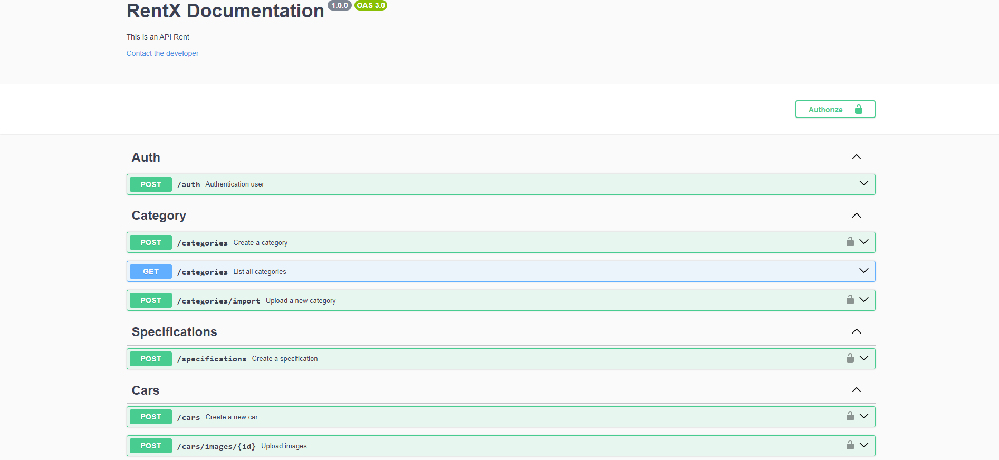

<h1 align="center">
  
</h1>

<h3 align="center">
  Rentx
</h3>

<p align="center">O Rentx é um projeto (API) para aluguel de carros</p>

<p align="center">
  <a href="#como-executar-o-projeto">Como executar o projeto</a>&nbsp;&nbsp;&nbsp;|&nbsp;&nbsp;
  <a href="#requisitos-da-aplicação">Requisitos da aplicação</a>&nbsp;&nbsp;&nbsp;|&nbsp;&nbsp;
  <a href="#anotações">Anotações</a>
</p>

<p align="center">Back-end</p>

<p align="center">
  
</p>

<p align="center">Banco de Dados</p>

<p align="center">
  
</p>

<p align="center">Documentação</p>

<p align="center">
  
</p>

## Como executar o projeto

### Clonar este repositório

```bash
git clone https://github.com/eliasmcastro/rocketseat-ignite-nodejs-rentx.git
```

### Requisitos

- [Node.js](https://nodejs.org)
- [Yarn](https://yarnpkg.com)
- [Docker](https://www.docker.com)

#### Opcional

- [Insomnia](https://insomnia.rest)
- [DBeaver](https://dbeaver.io/)

### Passos para a execução

**1. Instalar as dependências**

Instalar as dependências do projeto

```bash
yarn
```

**2. Criar os containers utilizando o Docker**

Criar e iniciar os containers do banco de dados e da aplicação

```bash
docker-compose up -d
```

**3. Executar as migrations**

Executar as migrations

```bash
yarn typeorm migration:run
```

**4. Criar usuário admin**

Executar o comando

```bash
yarn seed:admin
```
Dados do usuário:
 - email: admin@rentx.com.br
 - password: admin

**5. Rotas da aplicação**

- A aplicação começará a ser executada em http://localhost:3333
- A documentação da API pode ser acessada em http://localhost:3333/api-docs

_Dica: utilizar o Insomnia para testar as rotas_

- Abrir o Insomnia -> Application -> Preferences -> Data -> Import Data -> From File -> Selecionar o arquivo insomnia.json

**6. Banco de dados**

Você pode utilizar o DBeaver para acessar o banco de dados da aplicação, utilizando os seguintes dados de conexão:
  - Host: localhost
  - Database: rentx
  - Username: docker
  - Password: ignite

**7. Logs da aplicação**

Executar o comando `docker logs -f rentx`

**8. Operações com os containers criados**

- `docker-compose up` para criar e iniciar os containers
- `docker-compose start` para iniciar os containers
- `docker-compose stop` para parar os containers
- `docker-compose down` para remover os containers
- `docker-compose down -v --rmi local` para remover tudo (containers, volumes e imagens)

### Testes automatizados

Antes de executar os testes, é necessário criarmos um banco de dados exclusivo para os testes. Podemos fazer de duas formas:

**1. Utilizando alguma ferramenta (ex: DBeaver) para acesso ao banco de dados**

Acessar a ferramenta que você está utilizando para acessar o banco de dados e criar o banco de dados de teste chamado `rentx_test` com o comando abaixo:

Dados de conexão:
  - Host: localhost
  - Port: 5432
  - Username: docker
  - Password: ignite

```sql
create database rentx_test;
```

**2. Acessando diretamente o container do banco de dados**

Rodar o comando abaixo para obter o CONTAINER ID

```bash
docker ps
```

Acessar o container

```bash
docker exec -it ${CONTAINER ID} bash
```

Acessar o banco postgres

```bash
psql -U postgres
```

Criar o banco de dados de teste

```sql
create database rentx_test;
```

Visualizar todos os bancos de dados criados

```sql
\l
```

Sair do container

```bash
\q
```

```bash
exit
```

**3. Executar os testes unitários e de integração**

```bash
yarn test
```

## Requisitos da aplicação

### Cadastro de carro

**RF**
- Deve ser possível cadastrar um novo carro

**RN**
- Não deve ser possível cadastrar um carro com uma placa já existente
- O carro deve ser cadastrado, por padrão, com disponibilidade
- O usuário responsável pelo cadastro deve ser um usuário administrador

### Listagem de carros

**RF**
- Deve ser possível listar apenas os carros disponíveis
- Deve ser possível listar todos os carros disponível pelo nome da categoria
- Deve ser possível listar todos os carros disponível pelo nome do carro
- Deve ser possível listar todos os carros disponível pelo nome da marca

**RN**
- Não é necessário está logado no sistema para listar os carros cadastrados

### Cadastro de especificações no carro

**RF**
- Deve ser possível cadastrar uma ou mais especificações para um carro

**RN**
- Não deve ser possível cadastrar uma especificação para um carro não cadastrado
- Não deve ser possível cadastrar especificações com nomes duplicados para um mesmo carro
- Apenas usuários administradores pode cadastrar uma nova especificação

### Cadastro de imagens do carro

**RF**
- Deve ser possível cadastrar a imagem do carro

**RNF**
- Utilizar o multer para upload dos arquivos

**RN**
- O usuário pode cadastrar mais de uma imagem para o mesmo carro
- Apenas usuários administradores pode cadastrar as imagens

### Alugel de carro

**RF**
- Deve ser possível cadastrar um aluguel

**RN**
- O aluguel deve ter duração mínima de 24 horas
- Não deve ser possível cadastrar um novo aluguel caso já exista um aberto para o mesmo usuário
- Não deve ser possível cadastrar um novo aluguel caso já exista um aberto para o mesmo carro
- O usuário deve estar logado na aplicação
- Ao realizar um aluguel, o status do carro deverá ser - alterado para indisponível

### Devolução de carro

**RF**
- Deve ser possível realizar a devolução de um carro

**RN**
- Se o carro for devolvido com menos de 24 horas, deverá ser cobrado diária completa
- Ao realizar a devolução, o carro deverá ser liberado para outro aluguel
- Ao realizar a devolução, o usuário deverá ser liberado para outro aluguel
- Ao realizar a devolução, deverá ser calculado o total do aluguel
- Caso o horário de devolução seja superior ao horário previsto de entrega, deverá ser cobrado multa proporcional aos dias de atraso
- Caso haja multa, deverá ser somado ao total do aluguel
- O usuário deve estar logado na aplicação

### Listagem de Alugueis para usuário

**RF**
- Deve ser possível realizar a busca de todos os alugueis para o usuário

**RN**
- O usuário deve estar logado na aplicação

### Recuperar Senha

**RF**
- Deve ser possível o usuário recuperar a senha informando o e-mail
- O usuário deve receber um e-mail com o passo a passo para a recuperação da senha
- O usuário deve conseguir inserir uma nova senha

**RN**
- O usuário precisa informar uma nova senha
- O link enviado para a recuperação deve expirar em 3 horas

## Anotações

### Ferramentas utilizadas

- [Node.js](https://nodejs.org)
  - O Node.js deve ser instalado via [package manager](https://nodejs.org/en/download/package-manager/) utilizando o Chocolatey no Windows
    - Instalar o [Chocolatey](https://chocolatey.org/install)
    - Executar `cinst nodejs-lts` para instalar o Node.js
    - Executar `node -v` e `npm -v` para verificar se a instalação deu certo
- [Yarn](https://yarnpkg.com)
  - Instalar o Yarn
  - Executar `yarn -v` para verificar se a instalação deu certo
- [Visual Studio Code](https://code.visualstudio.com)

### Configurando estrutura

- `yarn init -y` cria o arquivo package.json
- `yarn add typescript -D` para instalar o TypeScript
- `yarn add express` para instalar o Express
- `yarn add @types/express -D` para instalar a definição de tipo da biblioteca Express
- `yarn add uuid` para instalar o UUID
- `yarn add @types/uuid -D` para instalar a definição de tipo da biblioteca UUID
- `yarn tsc --init` cria o arquivo de configuração do TypeScript
- `yarn add ts-node-dev -D` para instalar a ferramenta que reinicia automaticamente o servidor quando alterações nos arquivos são detectadas
- Em `package.json`:

  ```json
  "scripts": {
    "dev": "ts-node-dev --transpile-only --ignore-watch node_modules --respawn src/server.ts"
  }
  ```

### Padrões de Projeto com ESLint e Prettier

- [Documentação](https://www.notion.so/ESLint-e-Prettier-Trilha-Node-js-d3f3ef576e7f45dfbbde5c25fa662779)

- Nota: Foi necessário adicionar essa regra `"editor.formatOnSave": false` no settings.json do VSCode para funcionar

### Debugando Node.js pelo VS Code

- Criar arquivo `launch.json`, escolher Node.js e configurá-lo conforme as configurações abaixo:

  ```json
  {
    "version": "0.2.0",
    "configurations": [
      {
        "type": "node",
        "request": "attach",
        "restart": true,
        "name": "App Debug",
        "skipFiles": ["<node_internals>/**"]
      }
    ]
  }
  ```

- Para que o debugger possa se conectar à nossa aplicação, é necessário que o comando dev tenha a flag `--inspect`:

  ```json
  "scripts": {
    "dev": "ts-node-dev --inspect --transpile-only --ignore-watch node_modules --respawn src/server.ts"
  }
  ```

### SOLID

- S => SRP: Single Responsiblity Principle (Princípio da responsabilidade única)
- O => OCP: Open-Closed Principle (Princípio Aberto-Fechado)
- L => LSP: Liskov Substitution Principle (Princípio da substituição de Liskov)
- I => ISP: Interface Segregation Principle (Princípio da Segregação da Interface)
- D => DIP: Dependency Inversion Principle (Princípio da inversão da dependência)

### Upload de arquivos

- `yarn add multer` para instalar o multer
- `yarn add @types/multer -D` para instalar a definição de tipo da biblioteca multer

### Leitura de arquivos CSV

- `yarn add csv-parse` para instalar a csv-parse

### Swagger

- `yarn add swagger-ui-express` para instalar o swagger
- `yarn add @types/swagger-ui-express -D` para instalar a definição de tipo da biblioteca swagger
- Para acessar a documentação criada: http://localhost:3333/api-docs

### Docker e Docker Compose

- [Documentação de instalação do docker](https://efficient-sloth-d85.notion.site/Docker-e-Docker-Compose-16771f2ceefe4a05a8c29df4ca49e97a)
- `docker build -t rentx .` para criar imagem da aplicação
- `docker run -p 3333:3333 rentx` para criar container da imagem da aplicação
- `docker ps` para visualizar apenas os containers em execução
- `docker ps -a` para visualizar todos os containers (parados e em execução)
- `docker exec -it ${nomeContainer} /bin/bash` para acessar um container
  - CTRL + D para sair
- `docker logs -f ${nomeContainer}` para ver log de um container
- `docker start ${nomeContainer}` para iniciar um container
- `docker stop ${nomeContainer}` para parar um container
- `docker rm ${nomeContainer}` para remover um container
- `docker images` para listar imagens
- `docker rmi ${nomeImagen}` para remover uma imagem
- `docker-compose up` para criar e iniciar um container
- `docker-compose up -d` para criar e iniciar um container, mas libera o terminal
- `docker-compose up --force-recreate -d` para forçar re-criar e iniciar um container, mas libera o terminal
- `docker-compose start` para iniciar um container
- `docker-compose stop` para parar um container
- `docker-compose down` para remover um container
- `docker-compose down -v --rmi local` para remover tudo (containers, volumes e imagens)
- No Windows é necessário adicionar no script de dev no `package.json` a flag `--poll` para que qualquer alteração realizadas nos arquivos sejam refletidas no container

  ```json
  "scripts": {
    "dev": "ts-node-dev --inspect --transpile-only --poll --ignore-watch node_modules --respawn src/server.ts"
  }
  ```

### TypeORM

- `yarn add typeorm@0.2.45` para instalar o typeorm
  - [Atualizando o TypeORM no Rentx](https://efficient-sloth-d85.notion.site/Atualizando-o-TypeORM-no-Rentx-7988bcb23f9f417197fcf2113a74161a)
  - [Refatoração Docker com TypeORM](https://efficient-sloth-d85.notion.site/Refatora-o-Docker-com-TypeORM-4500fc0d075349ac9b97d670e734d41b)
- `yarn add reflect-metadata` para instalar o reflect-metadata
- `yarn add pg` para instalar o driver do PostgreSQL

### Migrations

- `yarn typeorm migration:create -n CreateCategories` para criar a migration de categorias
- `yarn typeorm migration:create -n CreateSpecifications` para criar a migration de categorias
- `yarn typeorm migration:create -n CreateUsers` para criar a migration de usuários
- `yarn typeorm migration:run` para executar as migrations criadas
- `yarn typeorm migration:revert` para reveter a execução das migrations

### Injeção de dependência

- `yarn add tsyringe` para instalar o TSyringe

### Criptografrar senha

- `yarn add bcryptjs` para instalar o bcrypt
- `yarn add @types/bcryptjs -D` para instalar a definição de tipo da biblioteca bcryptjs

### Token do usuário

- `yarn add jsonwebtoken` para instalar o jsonwebtoken
- `yarn add @types/jsonwebtoken -D` para instalar a definição de tipo da biblioteca jsonwebtoken

- Explicação sobre o uso de token e refreshToken
  - O usuário loga na aplicação e recebe um refreshToken e um token. O token vai ter uma expiração menor e o refreshToken uma expiração maior.
  - Quando o token expirar, vamos interceptar a chamada à API que deu erro e vamos enviar o refreshToken para o backend.
  - O back-end recebe o refreshToken e retorna um novo token válido para o front-end, junto com possivelmente um novo refreshToken atualizado também.
  - O front-end com os novos tokens recebidos, pode refazer as requests que falharam com novos tokens válidos e que não vão dar mais erros.
  - Mas também existem outras possibilidades nesse fluxo, por exemplo, caso o refreshToken seja inválido, ele retorna um erro para o front-end, então o front-end pode redirecionar o usuário para a página de login novamente para ele logar novamente.

### Tratando erros

- `yarn add express-async-errors` para instalar o express-async-errors

### Testes

- Testes unitários
- Testes de integração
- TDD (Test Driven Development)
- `yarn add jest -D` para instalar o jest
- `yarn add @types/jest -D` para instalar a definição de tipo da biblioteca jest
- `yarn add ts-jest -D` para instalar o ts-jest
- `yarn jest --init` cria o arquivo de configuração do jest
  - Would you like to use Jest when running "test" script in "package.json"? ... yes
  - Would you like to use Typescript for the configuration file? ... yes
  - Choose the test environment that will be used for testing » node
  - Do you want Jest to add coverage reports? ... no
  - Which provider should be used to instrument code for coverage? v8
  - Automatically clear mock calls, instances, contexts and results before every test? ... yes
- `yarn add supertest` para instalar o supertest (teste de integração)
- `yarn add @types/supertest -D` para instalar o supertest (teste de integração)

### Melhorando os imports

- `yarn add tsconfig-paths -D` para instalar o tsconfig-paths

- Adicionar no `tsconfig.json`

  ```json
  "baseUrl": "./src",
  "paths": {
    "@config/*": ["config/*"],
    "@modules/*": ["modules/*"],
    "@shared/*": ["shared/*"],
    "@utils/*": ["utils/*"]
  },
  ```

- Adicionar no script de dev e typeorm no `package.json` a flag `-r tsconfig-paths/register` para realizar a tradução do uso do @ nos imports

  ```json
  "scripts": {
    "dev": "ts-node-dev -r tsconfig-paths/register --inspect --transpile-only --poll --ignore-watch node_modules --respawn src/server.ts",
    "typeorm": "ts-node-dev -r tsconfig-paths/register ./node_modules/typeorm/cli",
  }
  ```

- Adicionar no `jest.config.ts` a propriedade abaixo

  Obs: Foi necessário remover todos os comentários do arquivo `tsconfig.json`

  ```ts
  import { pathsToModuleNameMapper } from 'ts-jest';
  import { compilerOptions } from './tsconfig.json';

  moduleNameMapper: pathsToModuleNameMapper(compilerOptions.paths, {
    prefix: '<rootDir>/src/',
  }),
  ```

### Trabalhando com datas

- `yarn add dayjs` para instalar o dayjs

### Variáveis de ambiente

- Caso esteja utilizando o Windows é necessário adicionar a lib `cross-env` para utilizar por exemplo o `NODE_ENV=test`
- `yarn add cross-env -D` para instalar o cross-env
- `yarn add dotenv` para instalar o dotenv

### Envio de e-mails

- Ferramenta para uso de e-mail em ambiente de Dev: [Ethereal](https://ethereal.email/)
- `yarn add nodemailer` para instalar o nodemailer
- `yarn add @types/nodemailer -D` para instalar a definição de tipo da biblioteca nodemailer
- Ferramenta para criar templates de e-mails: [Handlebars](https://handlebarsjs.com/)
- `yarn add handlebars` para instalar o handlebars

### Trabalhando com AWS

- `yarn add @aws-sdk/client-s3` para instalar o sdk da AWS S3

### Trabalhando com transformação de dados

- `yarn add class-transformer` para instalar o class-transformer

### Deploy

- Utilização do Babel para converter o código feito em TypeScript para JavaScript
- `yarn add @babel/cli @babel/core @babel/node @babel/plugin-proposal-class-properties @babel/plugin-proposal-decorators @babel/preset-env @babel/preset-typescript babel-plugin-module-resolver babel-plugin-transform-typescript-metadata -D` para instalar as dependências necessárias do Babel
- Criação do arquivo `babel.config.js`
- Em `package.json`:

  ```json
  "scripts": {
    "build": "babel src --extensions \".js,.ts\" --out-dir dist --copy-files",
  }
  ```
