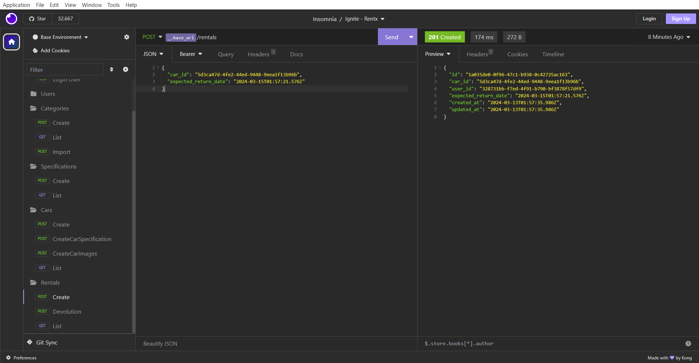

<h1 align="center">
  
</h1>

<h3 align="center">
  Rentx
</h3>

<p align="center">O Rentx é um projeto (API) para aluguel de carros</p>

<p align="center">
  <a href="#como-executar-o-projeto">Como executar o projeto</a>&nbsp;&nbsp;&nbsp;|&nbsp;&nbsp;&nbsp;
  <a href="#anotações">Anotações</a>
</p>

<p align="center">Back-end</p>

<p align="center">
  
</p>

<p align="center">Banco de Dados</p>

<p align="center">
  
</p>

## Como executar o projeto

### Clonar este repositório

```bash
git clone https://github.com/eliasmcastro/rocketseat-ignite-nodejs-rentx.git
```

### Requisitos

- [Node.js](https://nodejs.org)
- [Yarn](https://yarnpkg.com)

#### Opcional

- [Insomnia](https://insomnia.rest)
- [Docker](https://www.docker.com)

### Passos para a execução

**1. Executar aplicação**

Instalar as dependências do projeto

```bash
yarn
```

Iniciar o servidor de desenvolvimento

```bash
yarn dev
```

A aplicação começará a ser executada em http://localhost:3333

_Dica: utilizar o Insomnia para testar as rotas_

- Abrir o Insomnia -> Application -> Preferences -> Data -> Import Data -> From File -> Selecionar o arquivo insomnia.json

### Testes automatizados

Para executar os testes

```bash
yarn test
```

## Anotações

### Configurando estrutura

- `yarn init -y` cria o arquivo package.json
- `yarn add typescript -D` instala o TypeScript
- `yarn add express` instala o Express
- `yarn add @types/express -D` instala a definição de tipo da biblioteca Express
- `yarn add uuid` instala o UUID
- `yarn add @types/uuid -D` instala a definição de tipo da biblioteca UUID
- `yarn tsc --init` cria o arquivo de configuração do TypeScript
- `yarn add ts-node-dev -D` instala ferramenta que reinicia automaticamente o servidor quando alterações nos arquivos são detectadas
- Em package.json:

```json
"scripts": {
  "dev": "ts-node-dev --transpile-only --ignore-watch node_modules --respawn src/server.ts"
}
```

### Padrões de Projeto com ESLint e Prettier

- [Documentação](https://www.notion.so/ESLint-e-Prettier-Trilha-Node-js-d3f3ef576e7f45dfbbde5c25fa662779)

- Nota: Foi necessário adicionar essa regra `"editor.formatOnSave": false` no settings.json do VSCode para funcionar

### Debugando Node.js pelo VS Code

- Criar arquivo launch.json, escolher Node.js e configurá-lo conforme as configurações abaixo:

```json
{
  "version": "0.2.0",
  "configurations": [
    {
      "type": "node",
      "request": "attach",
      "restart": true,
      "name": "App Debug",
      "skipFiles": ["<node_internals>/**"]
    }
  ]
}
```

- Para que o debugger possa se conectar à nossa aplicação, é necessário que o comando dev esteja da seguinte maneira:

```json
"scripts": {
  "dev": "ts-node-dev --inspect --transpile-only --ignore-watch node_modules --respawn src/server.ts"
}
```

### SOLID

- S => SRP: Single Responsiblity Principle (Princípio da responsabilidade única)
- O => OCP: Open-Closed Principle (Princípio Aberto-Fechado)
- L => LSP: Liskov Substitution Principle (Princípio da substituição de Liskov)
- I => ISP: Interface Segregation Principle (Princípio da Segregação da Interface)
- D => DIP: Dependency Inversion Principle (Princípio da inversão da dependência)

### Upload de arquivos

- `yarn add multer` para instalar o multer
- `yarn add @types/multer -D` instala a definição de tipo da biblioteca multer

### Leitura de arquivos CSV

- `yarn add csv-parse` para instalar a csv-parse

### Swagger

- `yarn add swagger-ui-express` para instalar o swagger
- `yarn add @types/swagger-ui-express -D` instala a definição de tipo da biblioteca swagger

### Docker e Docker Compose

- [Documentação de instalação do docker](https://efficient-sloth-d85.notion.site/Docker-e-Docker-Compose-16771f2ceefe4a05a8c29df4ca49e97a)

- `docker build -t rentx .` criar imagem da aplicação
- `docker run -p 3333:3333 rentx` criar container da imagem da aplicação
- `docker ps` visualizar apenas os containers em execução
- `docker ps -a` visualizar todos os containers (parados e em execução)
- `docker exec -it ${nomeContainer} /bin/bash` acessar um container
  - CTRL + D para sair
- `docker logs -f ${nomeContainer}` ver log de um container
- `docker start ${nomeContainer}` iniciar um container
- `docker stop ${nomeContainer}` parar um container
- `docker rm ${nomeContainer}` remover um container
- `docker images` listar imagens
- `docker rmi ${nomeImagen}` remover uma imagem
- `docker-compose up` criar e iniciar um container
- `docker-compose up -d` criar e iniciar um container, mas libera o terminal
- `docker-compose start` iniciar um container
- `docker-compose stop` parar um container
- `docker-compose down` remover um container
